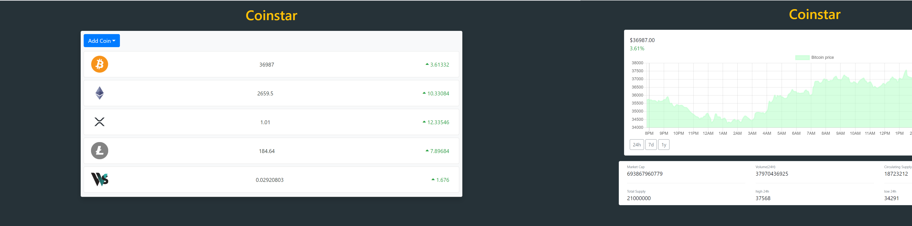

# <div align="center">� React CoinTracker</div>
<a href="https://cointracker-658f0.web.app"/>

                             </a>
<p align="center">Criptocoin tracker getting data from coingecko api with Axios, React and chartjs</p>

## 🛠️ Technologies

<ul>
  <li><a href="https://reactjs.org/">React</a></li>
  <li><a href="https://firebase.google.com/?hl=pt-br">Firebase</a></li>
</ul>

## ⚙️ Requirements

<ul>
  <li><a href="https://git-scm.com/">Git</a></li>
  <li><a href="https://nodejs.org/en/">Node.js</a></li>
  <li><a href="https://www.npmjs.com/">NPM</a></li>
</ul>

## 🚀 Installation

```
$ git clone https://github.com/gabrielpasquantonio/cryptocoin-tracker.git
$ cd cryptocoin-tracker
$ npm install
$ npm start
```

The application will open in the browser on http://localhost:3000
